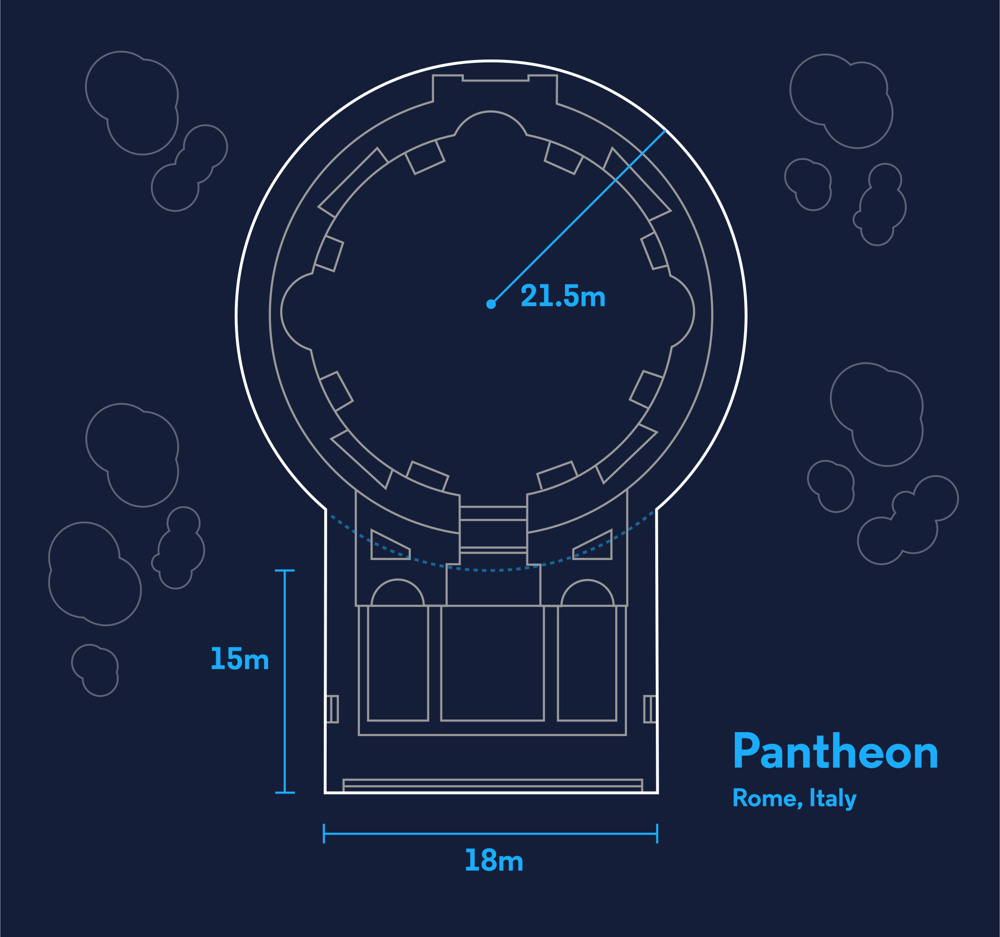

# Architect-Arithmetic

A dotnet program that calculates the cost of any floor plan depending on the dimensions.
The program has built-in the calculations for the famous monuments: Teotichuacan, Taj Mahal, The Pantheon and the Great Mosque of Mecca.
The specific dimensions for the floor plans can be found below. Price per tile has to be specified during program run time.

Clone repository and run *dotnet run* in terminal.

